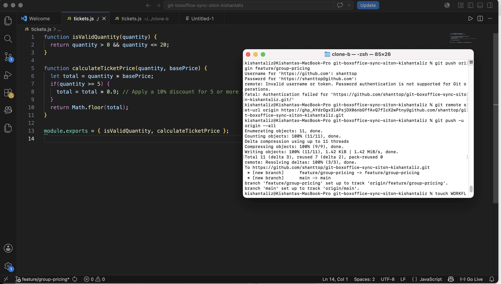
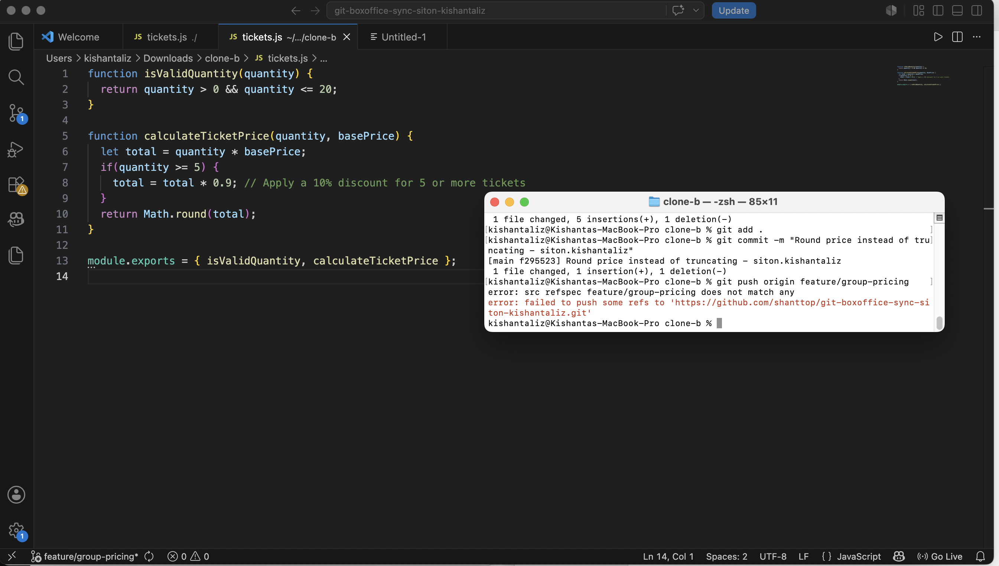
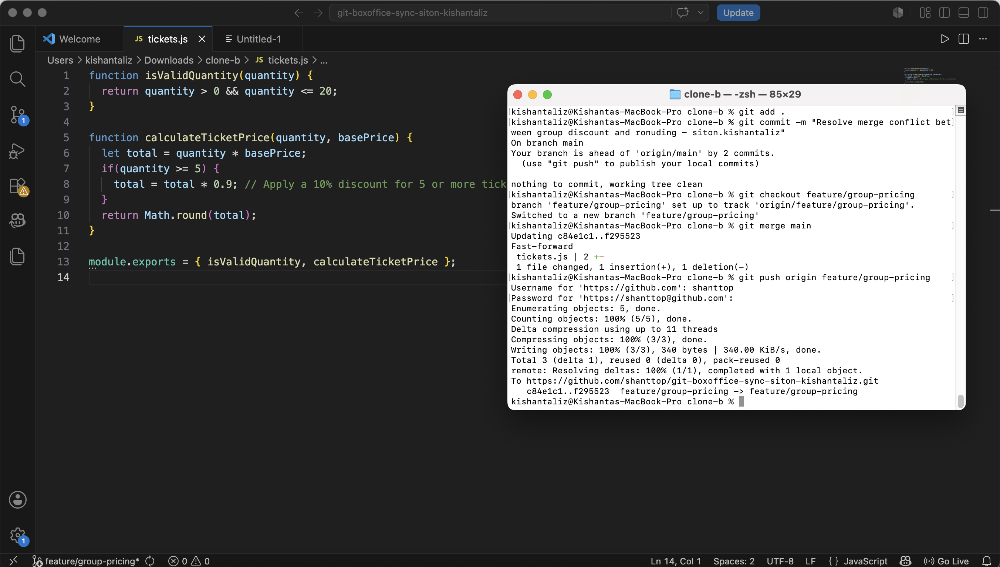
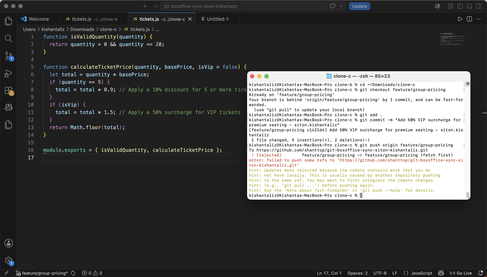
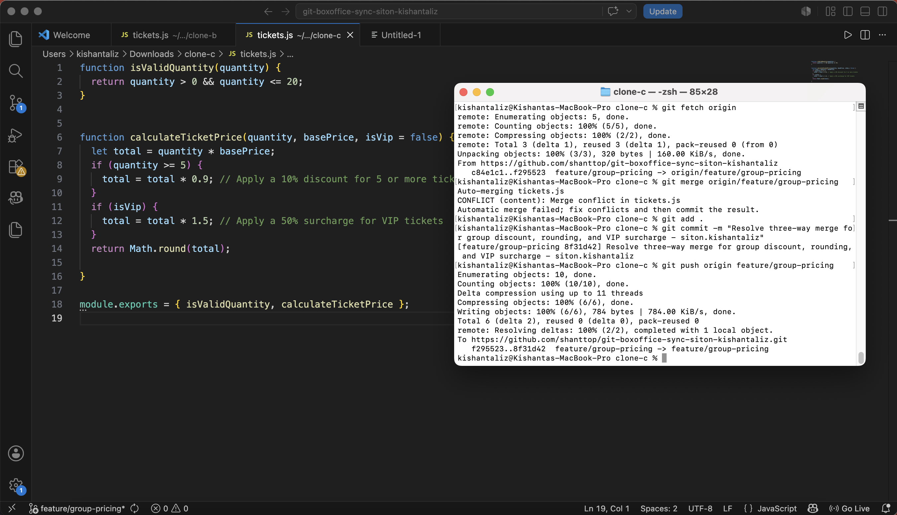
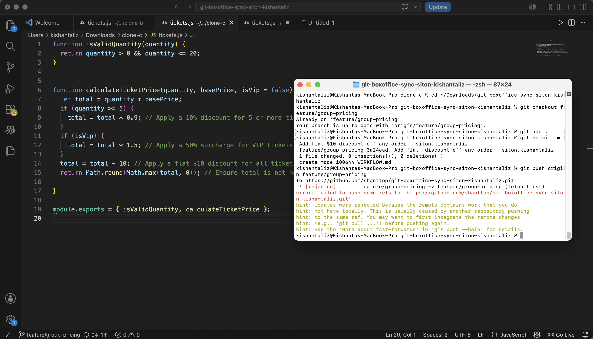
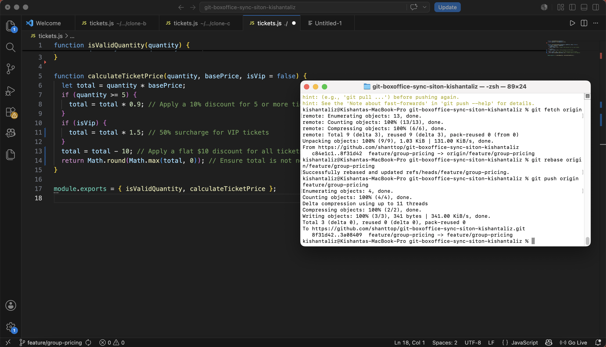
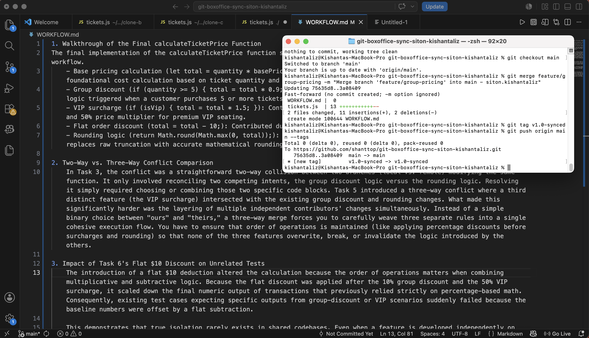

1. Walkthrough of the Final calculateTicketPrice Function
The final implementation of the calculateTicketPrice function successfully integrates contributions from every stage of the workflow.
    - Base pricing calculation (let total = quantity * basePrice;): Provided by the initial repository baseline, establishing the foundational cost calculation based on ticket quantity and base price.
    - Group discount (if (quantity >= 5) { total = total * 0.9; }): Contributed during Task 1, implementing the 10% discount logic triggered when a customer purchases 5 or more tickets.
    - VIP surcharge (if (isVip) { total = total * 1.5; }): Contributed during Task 4, introducing the optional boolean parameter and 50% price multiplier for premium VIP seating.
    - Flat order discount (total = total - 10;): Contributed during Task 6, applying the flat $10 order-wide deduction.
    - Rounding logic (return Math.round(Math.max(0, total));): Contributed during Task 2-3, ensuring that the final output replaces raw truncation with accurate mathematical rounding while preventing negative total values.

2. Two-Way vs. Three-Way Conflict Comparison
    In Task 3, the conflict was a straightforward two-way collision between two branches (local vs. remote) modifying the same function. It only involved reconciling two competing intents, the group discount logic versus the rounding logic. Resolving it simply required choosing or combining those two specific code blocks. Task 5 introduced a three-way conflict where a third distinct feature (the VIP surcharge) intersected with the existing group discount and rounding changes. What made this significantly harder was the layering of multiple independent contributors' changes simultaneously. Instead of a simple binary choice between "ours" and "theirs," a three-way merge forces you to carefully weave three separate rules into a single cohesive execution flow. You have to ensure that order of operations is maintained (like applying percentage discounts before surcharges and rounding) so that none of the three features overwrite, break, or invalidate the logic introduced by the others.

3. Impact of Task 6's Flat $10 Discount on Unrelated Tests
    The introduction of a flat $10 deduction altered the calculation because the order of operations matters when combining multiplicative and subtractive logic. Because the flat discount was applied after the 10% group discount and the 50% VIP surcharge, it scaled down the final numeric output of transactions that previously relied strictly on percentage-based math. Consequently, existing test cases expecting specific outputs from group-discount or VIP scenarios suddenly failed because the baseline numbers were offset by a flat subtraction.

    This demonstrates that true isolation rarely exists in shared codebases. Even when a feature is developed independently on its own branch, modifying a shared function (like calculateTicketPrice) creates implicit coupling. It highlights the risk that modifying global calculation sequences can unintentionally break contracts or assertions expected by other components, emphasizing the absolute necessity of comprehensive regression and integration testing.

4. Preventing All Three Rejected Pushes
    If this were to happen in a real-life setting, it would best to implement a strict team workflow utilizing pull requests (PRs) or requiring developers to pull/rebase remote updates (git pull --rebase origin main) before beginning local work would have completely prevented the divergent histories that caused the rejected pushes. Rejected pushes occur when developers work on stale local snapshots that diverge from the remote main repository. If the team enforced a rule requiring everyone to fetch and rebase (git pull --rebase) against the latest remote changes before committing local work or pushing, local branches would stay synchronized with the shared history. This transforms downstream merge conflicts into real-time, proactive integrations, eliminating unexpected rejections entirely.

## Task Screenshots

* **Task 1:** 
* **Task 2:** 
* **Task 3:** 
* **Task 4:** 
* **Task 5:** 
* **Task 6 (Rejected Push):** 
* **Task 6 (Successful Rebase/Push):** 
* **Task 7:** 